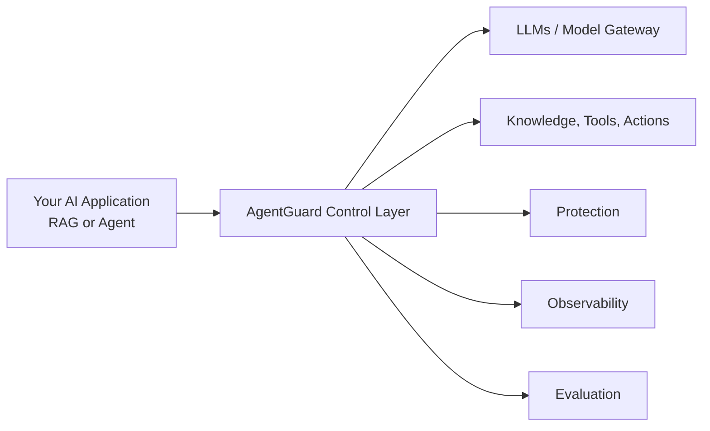

# AgentGuard

**AgentGuard is a self-hosted AI reliability platform for RAG and agentic applications.**

It helps teams detect, evaluate, and prevent costly AI incidents before they become customer-visible.

[](LICENSE)
[](https://github.com/glaborie/agentguard/actions/workflows/ci.yml)
[](https://codecov.io/gh/glaborie/agentguard)
[](https://www.python.org/downloads/)
[](https://github.com/glaborie/agentguard/commits/main)

## Why AgentGuard

AI applications can fail in expensive ways:
- hallucinated pricing or policy answers
- unsafe or misleading outputs
- PII leakage
- regressions after prompt, model, retrieval, or tool changes

AgentGuard provides a control layer for observing, protecting, and evaluating those systems.

## What it does

- **Observability** — traces, retrieval, latency, model behavior, and tool usage (Langfuse + Arize AX + Grafana + Jaeger)
- **Protection** — prompt injection blocking (regex + LLM-judge semantic pass), toxic content detection, PII masking, and agent tool-call guardrails
- **Evaluation** — DeepEval + RAGAS metrics, golden datasets, benchmarks, regression checks, and scoring
- **Red teaming** — automated adversarial probing across 4 attack types (prompt injection, jailbreak, PII extraction, system prompt leak) with CI-compatible exit codes
- **Support for RAG and agents** — works across both retrieval pipelines and agentic workflows

## Why AgentGuard, not just observability or evals?

Production AI failures are costly.

When a RAG assistant hallucinates policy, an agent takes the wrong action, or a model response leaks sensitive data, the result is not just a bad answer — it is a business incident.

Most teams stitch together separate tools for tracing, evaluations, and guardrails. That creates gaps:
- observability shows what happened, but does not prevent it
- evaluations measure quality, but do not protect runtime behavior
- guardrails block narrow failure modes, but do not provide release confidence

AgentGuard brings these controls together in one platform so teams can:
- observe live AI behavior
- test high-risk scenarios before release
- block or reduce costly failures in production

It is built for teams that need more than model experimentation — they need operational control.

## Architecture at a glance



For the full system view, see [Architecture](docs/architecture.md).

For Observability views, see [Screenshots](docs/screenshots.md).

## Who it’s for

- AI engineers building RAG or agentic systems
- platform teams standardizing AI reliability
- technical product owners responsible for release confidence
- teams handling sensitive, regulated, or business-critical workflows

## Use cases

- **Customer support assistants** — reduce hallucinated pricing, refund, and policy answers before they become customer-visible incidents.
- **Internal knowledge copilots** — monitor retrieval quality, evaluate answer faithfulness, and reduce sensitive data exposure.
- **Agentic workflows** — trace tool usage, benchmark outcomes, and catch costly action errors before production rollout.
  
## Quick Start

```bash
cp .env.example .env
docker compose up -d
pip install -r requirements.txt
python -m app.main ingest
python -m app.main query "Does the Starter plan include SAML SSO?"
```

Open:
- Open WebUI: `http://localhost:3100`
- Langfuse: `http://localhost:3200`
- Arize AX: `https://app.arize.com` (project: `agentguard`)

## GitHub MCP Integration

The `agentguard-agent` and `agentguard-agent-claude-haiku` models include GitHub tool access via a [Model Context Protocol](https://modelcontextprotocol.io) sidecar.

**Available tools:** search repositories, read file contents, list issues, list pull requests, create issues, and more (27 tools total).

**Setup** — add your GitHub token to `.env`:

```bash
GITHUB_MCP_URL=http://localhost:8091/mcp
GITHUB_PERSONAL_ACCESS_TOKEN=ghp_...   # repo + read:org scopes
```

The `github-mcp` container is profile-gated (`mcp`) in Compose. Start it with either:

```bash
docker compose --profile mcp up -d
# or only the MCP sidecar
docker compose --profile mcp up -d github-mcp
```

**Try it** in Open WebUI — select `agentguard-agent-claude-haiku` and ask:

```
Summarize the open issues in glaborie/agentguard
```

**URL split:** CLI uses `localhost:8091`; the `rag-api` container reaches the sidecar via `http://github-mcp:8080/mcp` (set in `docker-compose.yml` environment block, overriding `.env`).

## Runtime Controls and Debugging

AgentGuard includes runtime controls and retrieval diagnostics exposed by the API:

- Control panel UI: `http://localhost:8001/dashboard`
- Read feature flags: `GET http://localhost:8001/api/config`
- Update feature flags: `PATCH http://localhost:8001/api/config`
- Reset feature flags: `POST http://localhost:8001/api/config/reset`
- Retrieval debug API: `POST http://localhost:8001/api/retrieval/debug`

CLI equivalent for retrieval diagnostics:

```bash
python -m app.main debug-retrieval "Does the Starter plan include SAML SSO?"
python -m app.main debug-retrieval "discount approval policy" --mode hybrid --json
```

## Documentation

- [Roadmap](docs/ROADMAP.md)
- [Architecture](docs/architecture.md)
- [Local deployment](docs/deployment/local.md)
- [Evaluation](docs/evaluation.md)
- [Repository conventions](docs/repository-conventions.md)
- [Recruiter documentation pack](docs/recruiter/README.md)
- [Agent workflow](docs/agent-workflow.md)
- [TODO / SOTA gaps](TODO.md)

## Contributing

See [CONTRIBUTING.md](CONTRIBUTING.md).

## Security

See [SECURITY.md](SECURITY.md).

## License

Licensed under the Apache License, Version 2.0. See [LICENSE](LICENSE).
