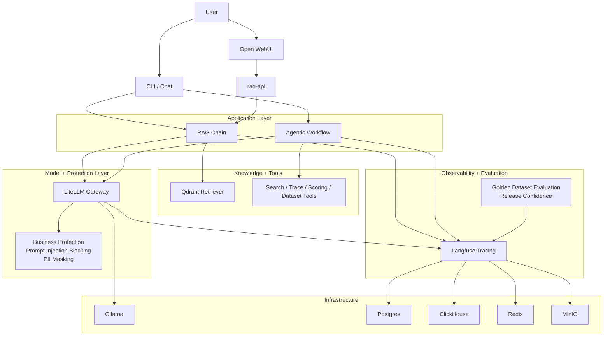

# AgentGuard

**AgentGuard is a self-hosted control layer for preventing costly incidents in AI applications.**

It supports both **RAG** and **agentic** applications by helping teams detect, evaluate, and block failures before they reach users.

When an AI assistant hallucinates a discount, misstates company policy, leaks sensitive data, or regresses after a prompt, model, retrieval, or tool change, the result is not just a bad answer — it is a business incident.

## Problem

LLM applications — whether RAG assistants or agentic systems — can create customer-facing incidents by hallucinating offers, exposing PII, giving unsafe answers, taking incorrect actions, or silently regressing after system changes.

## Target User

AI engineers, platform teams, and technical product owners responsible for operating RAG or agentic AI applications where failures carry business, compliance, or reputational risk.

## Success Metric

The percentage of AI incidents detected or prevented before they become customer-visible.

## How AgentGuard helps

AgentGuard combines four control mechanisms for AI applications:

- **Observability** — trace requests, retrieval steps, tool usage, model behavior, latency, and failure modes
- **Business protection** — reduce unsafe behavior, policy bypass, and sensitive data exposure
- **PII protection** — detect and redact sensitive data in model outputs
- **Golden dataset evaluation** — test critical business scenarios against a curated set of known-good examples before and after changes

## What is a golden dataset?

A golden dataset is a curated collection of representative prompts and expected answers that defines what correct behavior looks like for your AI application.

It works like a regression suite for an LLM system. For example, you can include high-risk scenarios such as:
- pricing and discount questions
- refund and policy questions
- compliance-sensitive prompts
- sensitive data handling
- known production failure cases

When you change a prompt, model, retriever, or tool, AgentGuard can run those golden examples again to detect regressions before the change becomes customer-visible.

## Architecture



## Platform Components

AgentGuard runs as a self-hosted stack that combines observability, retrieval, model routing, UI, and evaluation into one environment for operating AI applications safely.

| Component | Port(s) | Role in the platform |
|---|---|---|
| **langfuse-web** | 3000 | Observability UI and API for traces, scores, and datasets |
| **langfuse-worker** | 3030 (local only) | Background processing for trace and event ingestion |
| **postgres** | 5432 (local only) | Relational storage for Langfuse and supporting services |
| **clickhouse** | 8123, 9000 (local only) | Analytics store for high-volume observability data |
| **redis** | 6300 (host) -> 6379 (container) | Cache and queue backend |
| **minio** | 9090 (API), 9091 (console, local only) | S3-compatible object storage |
| **ollama** | 11434 | Local model runtime for embeddings |
| **litellm** | 4000 | OpenAI-compatible model gateway and protection enforcement layer |
| **qdrant** | 6333 (HTTP), 6334 (gRPC, local only) | Vector store for retrieval |
| **rag-api** | 8001 | OpenAI-compatible API surface for the RAG application |
| **openwebui** | 3001 | End-user chat interface for interacting with the application |
| **portainer** | 9443 | Container administration UI |
| **dozzle** | 8080 | Real-time container log viewer |
| **minio-init** | — | One-time initialization of object storage buckets |
| **litellm-init** | — | One-time initialization of LiteLLM configuration |

## Prerequisites

To run AgentGuard locally, you need:

- **Docker** with Compose v2
- **Python 3.11+**
- **~15 GB RAM** allocated to Docker
- **NVIDIA GPU + drivers** if you want Ollama GPU acceleration  
  (CPU-only works, but will be slower)

## Quick Start

The fastest way to experience AgentGuard is:

### 1. Clone and configure

```bash
cp .env.example .env
# Edit .env if you want to change passwords or add an OpenRouter API key
```

### 2. Start the platform

```bash
docker compose up -d
```

Check that services are healthy:

```bash
docker compose ps
```

### 3. Pull the embedding model

```bash
docker compose exec ollama ollama pull nomic-embed-text
```

### 4. Install Python dependencies

```bash
pip install -r requirements.txt
```

### 5. Ingest the knowledge base

This step scrapes the Langfuse Academy pages and indexes them in Qdrant for retrieval.

```bash
python -m app.main ingest
```

### 6. Test the RAG path

```bash
python -m app.main query "What is the AI Engineering Loop?"
```

### 7. Test the agentic path

The agent can combine document search, trace inspection, response scoring, and dataset inspection.

```bash
python -m app.main agent "How is my RAG system performing?"
```

### 8. Start an interactive agent session

```bash
python -m app.main agent-chat --session my-session
```

### 9. Use the web chat UI

Open [http://localhost:3001](http://localhost:3001), create an admin account on first visit, then select **agentguard-rag** from the model dropdown.

Every message you send goes through the full application stack, including retrieval, model routing, tracing, and protection layers.

### 10. Inspect traces and scores

Open [http://localhost:3000](http://localhost:3000) and sign in with:

- **Email:** admin@local.dev
- **Password:** admin123456

You should now see traces with request inputs, outputs, retrieval context, latency, and evaluation data.

## LLM Routing

All LLM requests go through the LiteLLM proxy, which provides a unified OpenAI-compatible API. Available models are configured in `litellm_config.yaml`:

| Model name | Backend | Notes |
|---|---|---|
| `nomic-embed-text` | Ollama (local) | Embedding only — the only model served locally |
| `openrouter-gemini-flash` | OpenRouter → Gemini 2.5 Flash Lite | Default chat model (needs API key) |
| `openrouter-mistral` | OpenRouter → Mistral Nemo | Alternative cloud model (needs API key) |

Switch models per query:

```bash
python -m app.main query "What is tracing?" --model openrouter-mistral
```

## ReAct Agent

Beyond simple RAG, AgentGuard includes a LangGraph ReAct agent that reasons about which tools to use:

| Tool | What it does |
|---|---|
| `search_docs` | Search the Qdrant knowledge base |
| `list_traces` | List recent Langfuse traces (ID, latency, input/output preview) |
| `get_trace_detail` | Drill into a specific trace with full observation tree |
| `score_response` | Run code-based evaluators on any text |
| `get_dataset_summary` | List datasets or inspect dataset items |

The agent can answer complex questions that require multiple tool calls — e.g., "How is my RAG system performing?" triggers trace inspection, detail drill-down, and quality scoring.

```bash
python -m app.main agent "What were my slowest queries?"
python -m app.main agent-chat --session demo
```

## Business Protection

AgentGuard helps reduce the risk of customer-facing AI incidents by screening requests and responses for unsafe or non-compliant behavior.

This includes preventing common failure modes such as:
- attempts to override system instructions
- unsafe or misleading responses
- accidental exposure of personally identifiable information (PII)
- behavior that drifts away from expected policy or business rules

In the current implementation, AgentGuard applies two built-in protections on LiteLLM traffic by default:

| Protection | What it does | Business value |
|---|---|---|
| **Prompt injection blocking** | Detects and blocks common attempts to manipulate or override the assistant’s instructions before the model responds | Reduces the risk of policy bypass, unsafe behavior, and untrusted outputs |
| **PII masking** | Redacts email addresses, SSNs, credit card numbers, and phone numbers from model responses | Reduces the risk of exposing sensitive user or customer data |

Both protections are enabled by default in `litellm_config.yaml`, so they apply automatically without per-request configuration.

## Release Confidence

AgentGuard helps teams verify that an AI application still behaves correctly after changes to prompts, models, retrieval logic, or tools.

Instead of waiting for users to discover regressions in production, teams can evaluate known high-risk scenarios in advance and track quality over time.

This supports release confidence in three ways:

| Capability | What it checks | Why it matters |
|---|---|---|
| **Automated response checks** | Verifies basics such as citation presence, response length, hallucination markers, and output format | Catches simple quality failures before they become user-visible |
| **LLM-based quality review** | Scores answers for relevance, faithfulness, and completeness | Helps assess whether responses are actually useful and grounded |
| **Golden dataset regression testing** | Replays known-good business scenarios across prompts, models, and retrieval changes | Helps prevent silent regressions after system updates |

### Automated response checks (`app/eval/evaluators.py`)

AgentGuard includes deterministic checks for common response-quality issues:

- `has_source_citation` — checks whether the response references a source
- `is_within_length` — enforces a response length limit
- `contains_no_hallucination_markers` — flags hedging language that may indicate weak confidence or unsupported claims
- `is_valid_json` — validates JSON output format when structured output is expected

### LLM-based quality review (`app/eval/evaluators.py`)

AgentGuard also supports model-based review of answer quality using three dimensions:

- **relevance** — does the answer address the question?
- **faithfulness** — is the answer grounded in the retrieved context?
- **completeness** — does the answer cover what the user asked?

### Advanced quality metrics (`app/eval/deepeval_metrics.py`)

For deeper analysis, AgentGuard integrates [DeepEval](https://github.com/confident-ai/deepeval) through LiteLLM:

| Metric | What it measures |
|---|---|
| `FaithfulnessMetric` | Is the answer grounded in retrieved context? |
| `AnswerRelevancyMetric` | Does the answer address the question? |
| `ContextualRelevancyMetric` | Are the retrieved chunks relevant? |
| `HallucinationMetric` | Does the answer contain fabricated information? |

Run these checks against a golden dataset and push the results back to Langfuse automatically:

```bash
python -m app.main evaluate --dataset rag-eval-v1
python -m app.main evaluate --dataset rag-eval-v1 --metrics faithfulness,hallucination
```

### Comparing models and configurations (`app/eval/experiments.py`)

AgentGuard can compare multiple models against the same golden dataset so teams can make safer rollout decisions:

```bash
python -m app.main experiment \
  --dataset rag-golden-set \
  --models openrouter-gemini-flash,openrouter-mistral \
  --limit 10
```

## Testing

```bash
pytest -m "not integration"   # 206 unit tests, no Docker needed (~5s)
pytest -m integration          # 17 integration tests, Docker stack required
pytest -v                      # Full suite
```

Unit tests cover agent tools, graph structure, DeepEval metric wiring, protections, evaluators, config, RAG chain, ingestion, CLI dispatch, service error mapping, and route handlers. Integration tests cover service health, RAG API behavior, agent end-to-end runs, and protections.

## Project Structure

```
.
├── docker-compose.yml        # 14-service stack + 2 init containers
├── litellm_config.yaml       # LiteLLM model routing + guardrails config
├── requirements.txt          # Python dependencies
├── pyproject.toml            # pytest configuration
├── .env.example              # Environment template
├── app/
│   ├── main.py               # Bare entry point → app/cli/app.py::main()
│   ├── core/
│   │   ├── config.py         # Pydantic settings from .env (+ shim at app/config.py)
│   │   ├── tracing.py        # Langfuse client singleton + CallbackHandler factory
│   │   ├── telemetry.py      # OTel SDK bootstrap (+ shim at app/telemetry.py)
│   │   ├── logging.py        # configure_logging() — called once by CLI main()
│   │   └── ids.py            # request_id() / completion_id() generators
│   ├── cli/
│   │   ├── app.py            # Argument parser + dispatch via args.func(args)
│   │   ├── common.py         # Shared CLI helpers (flush, etc.)
│   │   └── commands/         # One module per command domain
│   │       ├── ingest.py     # ingest
│   │       ├── query.py      # query, chat
│   │       ├── agent.py      # agent, agent-chat
│   │       ├── evaluate.py   # evaluate, online-eval
│   │       ├── experiment.py # experiment
│   │       ├── dataset.py    # seed-dataset
│   │       └── regression.py # regression-gate
│   ├── api/
│   │   ├── app.py            # create_app() FastAPI factory
│   │   ├── schemas.py        # Message, ChatRequest Pydantic models
│   │   ├── streaming.py      # SSE stream_from_result()
│   │   ├── routes/           # Thin handlers: validate → call service → return
│   │   │   ├── health.py
│   │   │   ├── models.py
│   │   │   ├── webhook.py
│   │   │   └── chat.py
│   │   └── services/         # Business logic, one file per concern
│   │       ├── models_service.py   # MODELS, DIRECT_MODELS, get_model_list()
│   │       ├── health_service.py   # _probe(), check_all()
│   │       ├── feedback_service.py # parse_feedback(), push_score(), handle_webhook()
│   │       ├── direct_llm.py       # Direct LiteLLM call with error mapping
│   │       ├── rag_llm.py          # RAG chain invocation via rag_service
│   │       └── chat_service.py     # Dispatch orchestrator + response builder
│   ├── rag/
│   │   ├── service.py        # Stable interface: ingest(), query(), build_chain()
│   │   ├── ingest.py         # Document loading, chunking, embedding
│   │   └── chain.py          # LCEL RAG chain + ScoredRetriever
│   ├── agent/
│   │   ├── service.py        # Stable interface: run(), build_chat_session(), respond()
│   │   ├── tools.py          # 5 agent tools (search, traces, scoring, datasets)
│   │   ├── graph.py          # LangGraph ReAct agent (StateGraph + ToolNode)
│   │   └── prompts.py        # Agent system prompt
│   └── eval/
│       ├── service.py        # Stable interface: evaluate(), experiment(), regression_gate()
│       ├── evaluators.py     # Code-based + LLM-as-judge evaluators
│       ├── experiments.py    # Multi-model experiment runner
│       ├── deepeval_metrics.py  # LiteLLM model wrapper + DeepEval metric factories
│       └── deepeval_runner.py   # Evaluation runner with Langfuse score push
├── guardrails/
│   └── custom_guardrails.py  # Prompt injection + PII masking guards
└── tests/
    ├── test_agent_tools.py      # 22 tests: all 5 tool functions
    ├── test_agent_graph.py      # 13 tests: graph structure, routing, prompts
    ├── test_deepeval_metrics.py # 14 tests: LiteLLM model, metric factories
    ├── test_guardrails.py       # 43 tests: injection detection, PII masking
    ├── test_evaluators.py       # 16 tests: all code-based evaluators
    ├── test_config.py           # 3 tests: settings defaults + overrides
    ├── test_chain.py            # 9 tests: format_docs, prompt, e2e query
    ├── test_ingest.py           # 10 tests: chunking, loading, scraping
    ├── test_cli.py              # 21 tests: parser recognition, dispatch wiring
    ├── test_services.py         # 35 tests: service error mapping + flow logic
    ├── test_api_routes.py       # 16 tests: route handlers (skipped without fastapi)
    ├── test_agent_integration.py # 5 tests: agent e2e (requires Docker)
    └── test_integration.py      # 8 tests: service health, RAG API, guardrails
```

## The AI Engineering Loop

This project implements all five phases from the Langfuse Academy curriculum:

1. **Trace** - Every LangChain call is automatically captured via the Langfuse `CallbackHandler`, recording inputs, outputs, latencies, token usage, and retrieval context.

2. **Monitor** - The Langfuse dashboard provides real-time visibility into trace volumes, latency distributions, error rates, and cost tracking.

3. **Build Datasets** - Traces can be promoted to evaluation datasets directly in the Langfuse UI, creating labeled examples from real usage.

4. **Experiment** - The experiment runner (`app/eval/experiments.py`) systematically compares model variants against datasets, recording all results back to Langfuse.

5. **Evaluate** - Code-based evaluators provide deterministic checks; the LLM-as-judge evaluator provides nuanced quality assessment. Both feed scores into Langfuse for tracking over time.

## Windows Notes

Redis is mapped to host port **6300** instead of the default 6379 due to Windows dynamic port exclusion ranges (Hyper-V/WSL reserves port ranges that can include 6379). All container-internal ports remain default.