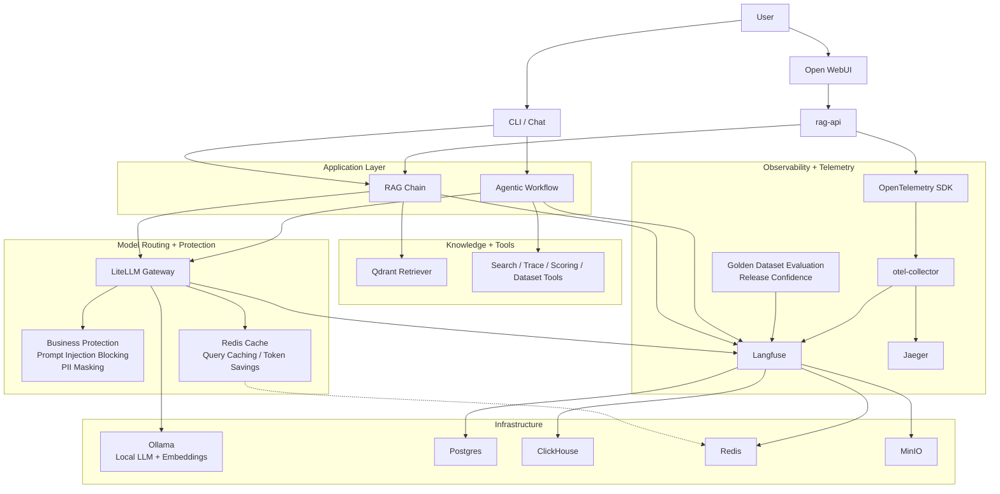
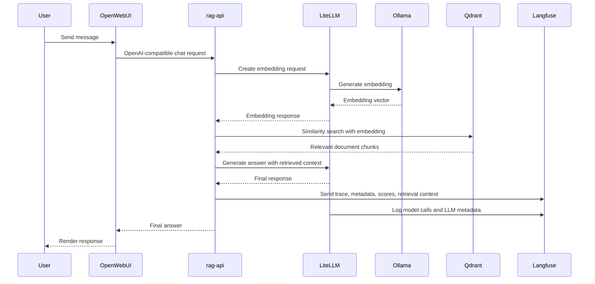

# Architecture

<!-- markdownlint-disable MD013 MD040 MD060 -->

AgentGuard is a self-hosted AI reliability platform for RAG and agentic applications.

It combines retrieval, model routing, protection, observability, evaluation, and user-facing interfaces into one stack for operating AI systems more safely.

## System architecture



## Message flow

The diagram below shows how a user message moves through the runtime path across the main application services.



## Platform components

AgentGuard runs as a self-hosted stack that combines observability, retrieval, model routing, UI, evaluation, and telemetry into one environment for operating AI applications safely.

| Component | Port(s) | Role in the platform |
|---|---|---|
| **langfuse-web** | 3200 -> 3000 (container) | Observability UI and API for traces, scores, and datasets |
| **langfuse-worker** | 3030 (local only) | Background processing for trace and event ingestion |
| **postgres** | 5500 -> 5432 (container) | Relational storage for Langfuse and supporting services |
| **clickhouse** | 8123 (HTTP), 9350 -> 9000 (native) | Analytics store for high-volume observability data |
| **redis** | internal only (6379) | Cache and queue backend |
| **minio** | 9299 -> 9000 (API), 9300 -> 9001 (console) | S3-compatible object storage |
| **ollama** | 11434 | Local model runtime to support local LLMs and embeddings |
| **litellm** | 4000 | OpenAI-compatible model gateway and protection enforcement layer |
| **qdrant** | 6333 (HTTP), 6334 (gRPC, local only) | Vector store for retrieval |
| **rag-api** | 8001 | OpenAI-compatible API surface for the RAG application |
| **openwebui** | 3100 -> 8080 (container) | End-user chat interface for interacting with the application |
| **agentguard-worker** | internal only | Feedback sync, online eval, and dataset build background loops |
| **openobserve** | 5080 | Log and trace analytics UI |
| **github-mcp** | 8091 -> 8080 (profile: mcp) | GitHub MCP sidecar for agent tool access |
| **traefik** | 80, 8090 | Local reverse proxy and dashboard |
| **otel-collector** | 4317, 4318 (docker-compose.infra.yml) | OpenTelemetry collection and fan-out to observability backends |
| **jaeger** | 16686 (docker-compose.infra.yml) | Trace visualization UI for end-to-end OpenTelemetry traces |
| **portainer** | 9443 (docker-compose.infra.yml) | Container administration UI |
| **minio-init** | — | One-time initialization of object storage buckets |
| **litellm-init** | — | One-time initialization of LiteLLM configuration |

## Project structure

```
.
├── docker-compose.yml        # Core app stack services + init containers
├── docker-compose.infra.yml  # Optional infra stack (otel-collector, jaeger, grafana, etc.)
├── litellm_config.yaml       # LiteLLM model routing + guardrails config
├── requirements.txt          # Python dependencies
├── pyproject.toml            # pytest configuration
├── .env.example              # Environment template
├── app/
│   ├── main.py               # Bare entry point → app/cli/app.py::main()
│   ├── core/
│   │   ├── config.py         # Pydantic settings from .env (+ shim at app/config.py)
│   │   ├── tracing.py        # Langfuse client singleton + CallbackHandler factory
│   │   ├── telemetry.py      # OTel SDK bootstrap (+ shim at app/telemetry.py)
│   │   ├── logging.py        # configure_logging() — called once by CLI main()
│   │   └── ids.py            # request_id() / completion_id() generators
│   ├── cli/
│   │   ├── app.py            # Argument parser + dispatch via args.func(args)
│   │   ├── common.py         # Shared CLI helpers (flush, etc.)
│   │   └── commands/         # One module per command domain
│   │       ├── ingest.py     # ingest
│   │       ├── query.py      # query, chat
│   │       ├── agent.py      # agent, agent-chat
│   │       ├── evaluate.py   # evaluate, ragas-experiment, online-eval
│   │       ├── experiment.py # experiment
│   │       ├── dataset.py    # seed-dataset
│   │       ├── regression.py # regression-gate
│   │       ├── benchmark.py  # benchmark
│   │       ├── red_team.py   # red-team
│   │       ├── retrieval_debug.py # debug-retrieval
│   │       └── drift.py      # drift-check
│   ├── api/
│   │   ├── app.py            # create_app() FastAPI factory
│   │   ├── schemas.py        # Message, ChatRequest Pydantic models
│   │   ├── streaming.py      # SSE stream_from_result()
│   │   ├── routes/           # Thin handlers: validate → call service → return
│   │   │   ├── health.py
│   │   │   ├── models.py
│   │   │   ├── webhook.py
│   │   │   ├── chat.py
│   │   │   ├── config.py     # /dashboard, /api/config, /api/config/reset
│   │   │   └── retrieval.py  # /api/retrieval/debug
│   │   └── services/         # Business logic, one file per concern
│   │       ├── models_service.py   # MODELS, DIRECT_MODELS, get_model_list()
│   │       ├── health_service.py   # _probe(), check_all()
│   │       ├── feedback_service.py # parse_feedback(), push_score(), handle_webhook()
│   │       ├── direct_llm.py       # Direct LiteLLM call with error mapping
│   │       ├── rag_llm.py          # RAG chain invocation via rag_service
│   │       ├── agent_llm.py        # Agent model execution path
│   │       └── chat_service.py     # Dispatch orchestrator + response builder
│   ├── rag/
│   │   ├── service.py        # Stable interface: ingest(), query(), build_chain()
│   │   ├── ingest.py         # Document loading, chunking, embedding
│   │   └── chain.py          # LCEL RAG chain + ScoredRetriever
│   ├── agent/
│   │   ├── service.py        # Stable interface: run(), build_chat_session(), respond()
│   │   ├── tools.py          # 5 agent tools (search, traces, scoring, datasets)
│   │   ├── graph.py          # LangGraph ReAct agent (StateGraph + guarded ToolNode)
│   │   ├── tool_guard.py     # Pre-execution tool-call guardrail (allowlist + injection check)
│   │   └── prompts.py        # Agent system prompt
│   └── eval/
│       ├── service.py        # Stable interface: evaluate(), experiment(), regression_gate()
│       ├── evaluators.py     # Code-based + LLM-as-judge evaluators
│       ├── experiments.py    # Multi-model experiment runner
│       ├── deepeval_metrics.py  # LiteLLM model wrapper + DeepEval metric factories
│       ├── deepeval_runner.py   # Evaluation runner with Langfuse score push
│       └── benchmark.py      # Benchmark runner: 3 modes × 5 metrics over NorthstarCRM corpus
├── guardrails/
│   └── custom_guardrails.py  # PromptInjectionGuard (regex + LLM-judge), ToxicityGuard, PIIMaskingGuard
└── tests/
    ├── test_agent_tools.py      # 22 tests: all 5 agent tool functions
    ├── test_agent_graph.py      # 13 tests: graph structure, routing, prompts
    ├── test_agent_tool_guard.py # 23 tests: allowlist, injection detection, limit bounds
    ├── test_deepeval_metrics.py # 14 tests: LiteLLM model, metric factories
    ├── test_guardrails.py       # 81 tests: injection detection, PII masking, toxicity detection, semantic guard
    ├── test_evaluators.py       # 16 tests: all code-based evaluators
    ├── test_config.py           # 3 tests: settings defaults + overrides
    ├── test_chain.py            # 9 tests: format_docs, prompt, e2e query
    ├── test_ingest.py           # 21 tests: corpus loader (md, jsonl, recursive, source path)
    ├── test_cli.py              # 29 tests: parser recognition, dispatch, session/user flags
    ├── test_services.py         # 35 tests: service error mapping + flow logic
    ├── test_api_routes.py       # 16 tests: route handlers (skipped without fastapi)
    ├── test_benchmark.py        # 38 tests: loaders, retrieval hit, factual coverage, escalation, _agg, CLI
    ├── test_agent_integration.py # 5 tests: agent e2e (requires Docker)
    └── test_integration.py      # 8 tests: service health, RAG API, guardrails
```

## Continuous improvement loop

AgentGuard implements a closed-loop improvement cycle that connects production traffic back to evaluation, enabling teams to iterate on AI systems with confidence.

1. **Trace** — Every LangChain call is automatically captured via the Langfuse `CallbackHandler`, recording inputs, outputs, latencies, token usage, and retrieval context.
2. **Monitor** — The Langfuse dashboard provides real-time visibility into trace volumes, latency distributions, error rates, and cost tracking. Online evaluators run automatically on new traces.
3. **Build datasets** — User feedback (thumbs-up/down via Open WebUI) is automatically synced and promoted into the `rag-golden-set` Langfuse dataset. Curated benchmark items live in `mock_corpus/07_benchmark/`.
4. **Experiment** — The experiment runner (`app/eval/experiments.py`) systematically compares model variants against golden datasets, recording all results back to Langfuse.
5. **Evaluate** — Code-based evaluators, DeepEval metrics, and the benchmark runner provide layered quality signals. The regression gate (`app/eval/service.py::regression_gate()`) enforces pass/fail thresholds for release decisions.
