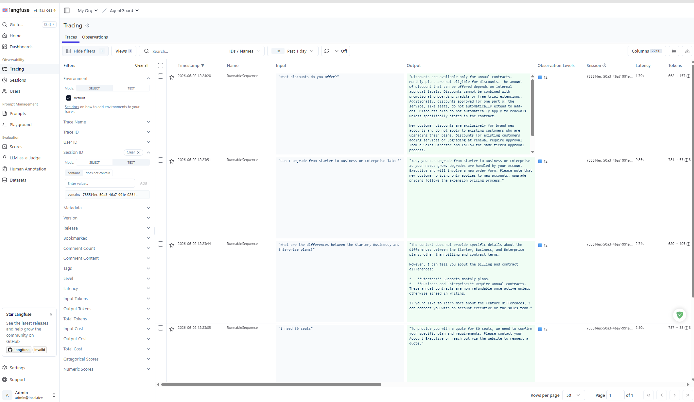
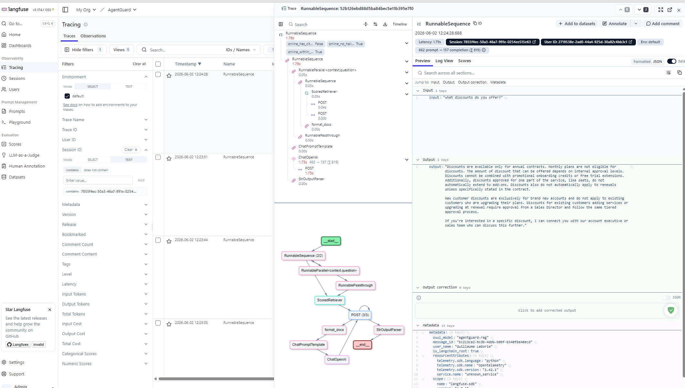

# Screenshots

This page shows selected UI views from AgentGuard in local development.

## Langfuse tracing view

The tracing view gives session-level visibility into application behavior, including user inputs, model outputs, latency, token usage, and trace structure.

### Chat Session with 4 traces

### Detailed trace

This helps teams inspect real sessions, diagnose failures, and understand how production behavior maps to evaluation and release confidence.
